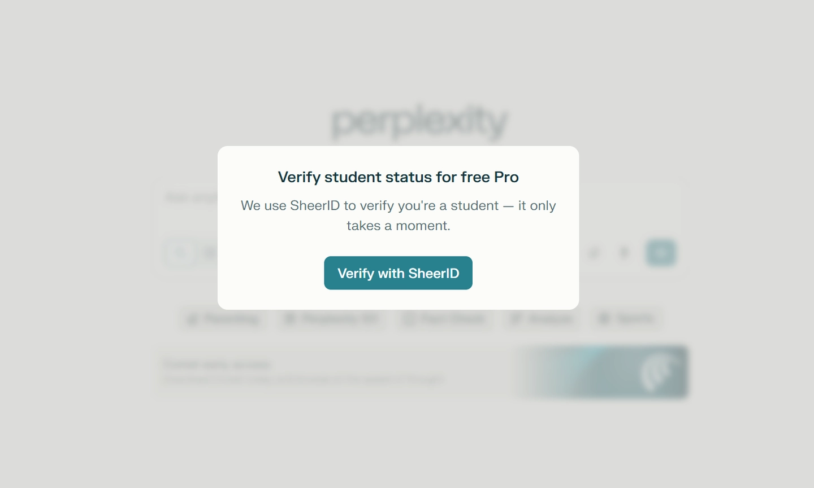

# 学生党白嫖Perplexity Pro完整指南：edu邮箱+学生证就能搞定

---

你是学生，手里有edu邮箱和学生证？那你就能免费用上Perplexity Pro，不花一分钱。这事儿说起来简单，但细节挺多——关代理、填信息、上传材料，哪个环节出错都可能卡住。这篇文章就是把整个流程拆开来讲，让你一次搞定，不走弯路。

---

## 准备好三样东西

开始之前，确认你手里有这三样：

- **学生证**（要能看清你的名字、学校、有效期）
- **学籍在线验证报告**（学信网下载，PDF格式最好）
- **edu邮箱**（你学校给你的那个，能正常收邮件）

这三样是认证的核心材料。学生证和学籍报告二选一理论上也行，但保险起见，我建议都准备好。edu邮箱必须能用，因为后面要验证。

---

## 第一步：打开认证页面并登录

访问Perplexity的学生认证入口，用你的账号登录（如果没账号就先注册一个）。登录后会自动跳转到认证界面，看到SheerID的验证页面就对了。

**重点来了：这时候必须关掉你的代理/VPN。** SheerID的验证系统对代理很敏感，开着代理大概率会卡住或者直接报错。关掉代理，用真实IP提交，成功率会高很多。

---

## 第二步：填写信息并验证邮箱

按照页面提示，如实填写以下信息：

- **姓名**（和学生证上的一致）
- **学校名称**（中国的大学都能找到，用中文搜索就行）
- **edu邮箱**（填完会收到验证邮件）
- **入学/毕业日期**（大概日期就行，不用精确到天）

填完点提交，系统会给你edu邮箱发验证码，去邮箱里找到邮件，点链接或者输入验证码。如果第一次没收到，等几分钟再试，或者检查一下垃圾邮件箱。

---

## 第三步:上传证明文件

邮箱验证通过后，会要求你上传文件证明学生身份。可以上传的材料包括：

- 学生证（拍照或扫描，确保信息清晰）
- 学籍在线验证报告（学信网下载的PDF）
- 学费收据或在读证明（如果有的话）

**关键点：** 文件里必须包含你之前填写的姓名、学校名称和时间信息。我当时上传了学生证+学籍验证报告，审核很快就过了。如果你只有学生证，也可以试试，但建议加上学籍报告更保险。

学籍在线验证报告怎么搞？去学信网（chsi.com.cn），登录后找到"在线验证报告"，生成一份中文版或英文版的PDF下载下来就行。

👉 顺便说一句，如果你嫌麻烦或者认证一直不过，也可以考虑直接[买个Perplexity Pro年费成品号，24小时自动发货，用起来省心多了](https://shaoyumi.com/buy/64)。

---

## 第四步：等待审核结果

提交文件后，一般几个小时内就能出结果（我当时是下午提交，晚上就通过了）。审核通过后，你会收到邮件通知，同时你的Perplexity账号会自动激活Pro权限，初始时长是1个月。

---

## 拉人头延长使用时长

拿到1个月Pro之后，你还可以通过邀请别人来延长时长——每邀请一个人成功认证，你就能多获得1个月Pro，最多可以累计到24个月（也就是2年）。

具体操作：进入Perplexity设置页面，找到"Referrals"（推荐）选项，复制你的专属邀请链接发给同学或朋友。他们通过你的链接注册并完成学生认证后,你俩都能得到额外1个月。

---

## 常见问题答疑

**Q: 我的学校在国内,能认证吗?**  
A: 可以。只要你有edu邮箱和正规学籍，国内大学都支持。我试过几所985/211和普通本科,都能过。

**Q: 必须关代理吗?**  
A: 强烈建议关。SheerID的风控系统对代理IP很敏感,开着代理提交很容易被拒。

**Q: 审核要多久?**  
A: 快的话几小时,慢的话1-2天。如果超过3天还没消息,可以发邮件催一下客服。

**Q: 毕业了还能用吗?**  
A: 理论上认证通过后,在你累计的时长内都能用（比如你拉满24个月）。但毕业后edu邮箱可能会失效,建议在校期间多邀请几个人把时长拉满。

**Q: 认证失败怎么办?**  
A: 检查三点——代理关了没、信息填对没、文件够清晰没。实在不行就换个材料重新提交,或者联系Perplexity客服问问具体原因。

---

整个流程就是这样。准备好材料,关掉代理,如实填信息,上传文件,等审核——大部分人都能一次过。如果你是学生党,这个羊毛不薅有点可惜。当然，如果你想更省事直接用上完整功能，[Perplexity Pro年费成品号也是个靠谱选择](https://shaoyumi.com/buy/64)，365天质保，24小时自动发货，适合不想折腾认证流程的朋友。
